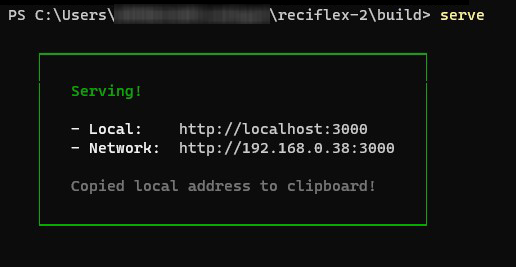

# Olá, bem-vindo ao Reciflex 2

## Sumário
  - [🍍 Problemática](#-problemática)
  - [📋 Requisistos](#-requisistos)
  - [👨‍💻 Tecnologias Utilizadas](#-tecnologias-utilizadas)
  - [💿 Como Instalar e Usar](#-como-instalar-e-usar)

## 🍍 Problemática

A grafica que trabalho imprimia e usava blocos de recibo personalizados que eram preenchidos a punho e que ocasionava os seguintes problemas:

1. Fila de clientes no atendimento que esperavam apenas pelos recibos serem preenchidos pelo operador do caixa e assinados a mão pelo gerente.

2. Custo de tempo ao financeiro pois nesse setor os recibos eram preenchidos, assinados pelo gerente e posteriormente escaneados para serem enviados via e-mail junto das notas fiscais.

3. Custo de mão de obra, ja que nós produziamos os recibos e que muitas vezes acabava virando um stress entre setores por conta da espera da confecção dos blocos.

4. Custo financeiro visto que qualquer erro levava ao descarte da via e reinicio do processo.

## 📋 Requisistos

| Requisitos Funcionais |
| :-------------------- |
O Sistema deve gerar o numero por extenso automaticamente para evitar erros ortograficos
Deve ter a possibilidade de gerar um arquivo de imagem para enviar via e-mail ou mensageiros
Deve ter a possibilidade de imprimir
Deve adicionar a data de forma facilitada
Deve incluir assinatura automaticamente e se possivel incluir mais de uma
Deve ter a possibilidade de incluir ou não o CNPJ do emissor 

| Requisitos NÃO Funcionais                                                                        |
| :----------------------------------------------------------------------------------------------- |
| O Sistema deve gerar recibos de forma mais facil e rapida se comparada com preenchimento a punho |
Deve ser otimizado para ser usado de qualquer computador mesmo os mais fracos
Deve ser intuitivo e direto

## 👨‍💻 Tecnologias Utilizadas


- Javascript
- ReactJS
- NodeJS
- Material UI
- dotenv
- react-to-print
- html2canvas
- Agradecimendo especial ao [JSFromHell](http://jsfromhell.com/string/extenso) pelo codigo que converte numeral para extenso em Javascript.


## 💿 Como Instalar e Usar

Este projeto foi pensado para ser usado em uma Rede local Privada, a instalação é feita num computador que pode ser um servidor de arquivos local, como é usado de costume nas pequenas graficas, esteja ciente que qualquer pessoa com acesso a Rede Local terá acesso ao serviço que instalaremos a seguir.

Escolha um computador ou servidor de arquivos para instalar, verifique se que tem instalado o NodeJS + NPM, caso contrario faça o download e instale antes de proseguir:

**[NodeJS Download](https://nodejs.org)**

1. Download e Instalação de dependencias:

   - Faça o download do projeto;
   - Abra o Terminal e navegue até a pasta do projeto;
   - Rode o comando `npm install` para baixar e instalar as dependencias;

2. Para configura-lo com dados da sua empresa: 

   - Localize o arquivo `.env.example` na raiz do projeto faça uma copia no mesmo diretório e renomeie para `.env`;
   - Abra o `.env` com um editor de texto _(pode ser com o bloco de notas do windows)_;
   - Preencha os campos entre aspas com os respectivos dados referentes a sua empresa seguindo a estrutura proposta;

    ```dosini
    REACT_APP_COMPANY_NAME="Nome da Empresa aqui"
    REACT_APP_APP_CNPJ="00.000.000/0000-00"

    REACT_APP_CONTACT_1="(00) 0 0000.0000"
    REACT_APP_CONTACT_2="email@company.com.br ou (00) 0 0000.0000"

    REACT_APP_STREET="Rua da Goiabeira"
    REACT_APP_NUMBER="123"
    REACT_APP_COMPLEMENT="loja 1"
    REACT_APP_DISTRICT="Bairro das Arvores"
    REACT_APP_CITY="Fortaleza"
    REACT_APP_STATE_ACRONYM="CE"

    REACT_APP_SIGNATURE_1_OWNER="Tobey Maguire"
    REACT_APP_SIGNATURE_2_OWNER="Andrew Garfield"
    REACT_APP_SIGNATURE_3_OWNER="Tom Holland"
    REACT_APP_SIGNATURE_4_OWNER="Stan Lee"
    ```

    - Ao finalizar a alterações salve e feche o editor de texto;

3. Inserir as Assinaturas:
    - Navegue até `/src/assets`;
    - Localize os Arquivos com nome `signature.jpg`;
    - Substitua-os pelos seus arquivos de assinatura e lembre de manter os mesmos nomes `signature1.jpg`, `signature2.jpg`...
    
>Para inserir as assinaturas precisamos que elas estejam escaneadas com fundo branco, cropadas e em formato JPG seguindo o mesmo formato das Assinaturas de Exemplo que estão na pasta, caso tenha dificuldades para fazer contacte um amigo designer ou use o [Microsoft Lens](https://play.google.com/store/apps/details?id=com.microsoft.office.officelens&hl=pt_BR&gl=US) para lhe auxiliar. 

4. Ainda na pasta `assets` substitua o arquivo `logo.png` pela logo da sua empressa mantendo o mesmo nome e extensão.

5. Para rodar e verificar se está tudo em ordem abra o terminal, navegue até a pasta do projeto e rode o comando `npm start` se estiver tudo em ordem ele irá abrir uma aba no seu navegador com o projeto funcionando, verifique se está tudo em ordem, tente emitir alguns recibos de teste para verificar se as assinaturas e os dados inseridos estão corretos, para finalizar o teste aperte `ctrl + C` 2 vezes no terminal.

6. Com tudo conferido vamos Instalar:
    - No terminal rode o comando `npm run build` e aguarde terminar, isso vai criar os arquivos que vamos implementar a seguir;
    - Será gerada uma pasta chamada `build` na raiz do diretório, ela é nosso projeto compilado e pronto para rodar, copie essa pasta para o local que desejar;
    - Abra um terminal e navegue até a pasta `build` e rode o comando `serve`, se tudo correr bem deve aparecer algo assim:

    

    - Para usar basta ir no navegar dos computadores da rede local e seguir com o endereço de Network, caso não seja possivel usar um ip fixo na maquina que está rodando a aplicação você também pode acessar usando o hostname do PC seguido da porta: `http://SERVIDOR-DE-ARQUIVOS:3000`;
    - Paca encerrar o serviço aperte `ctrl + C`.
    
    >Caso o servidor não fique ligado 24h vc pode usar o Agendador de Tarefas do windows para configurar a rotina de iniciar o serviço ao ligar a maquina. 
